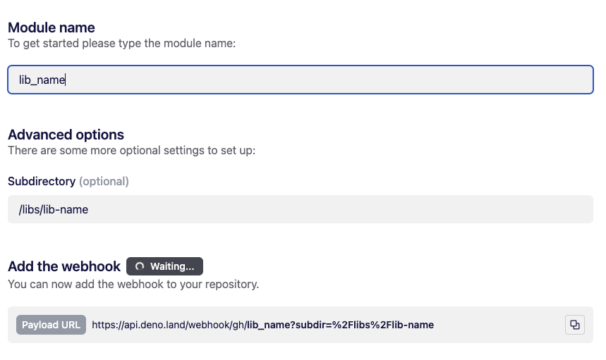

# Nx + Deno Publish Test

This package is just a test to see how to deploy to deno from an nx repo

```shell
deno run https://deno.land/x/test_deno_nx_lib/mod.ts
```

## Notes

When setting up the webhook just add the path to the folder with the mod.ts in it.


